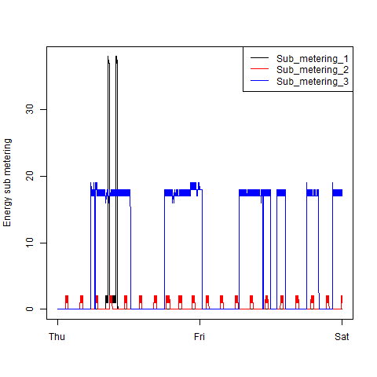

## Introduction

***This is the assignment result from Coursera Course Exploratory Data Analysis***

## Run

* "source" every source code

## Results

### Plot 1

 

### Plot 2

 

### Plot 3

 

### Plot 4

 

